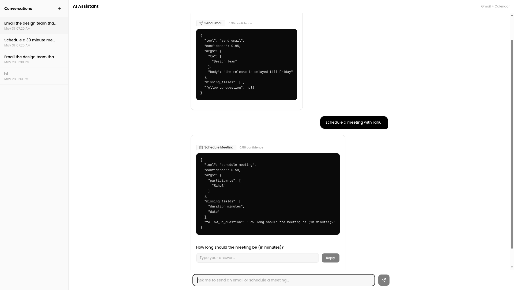
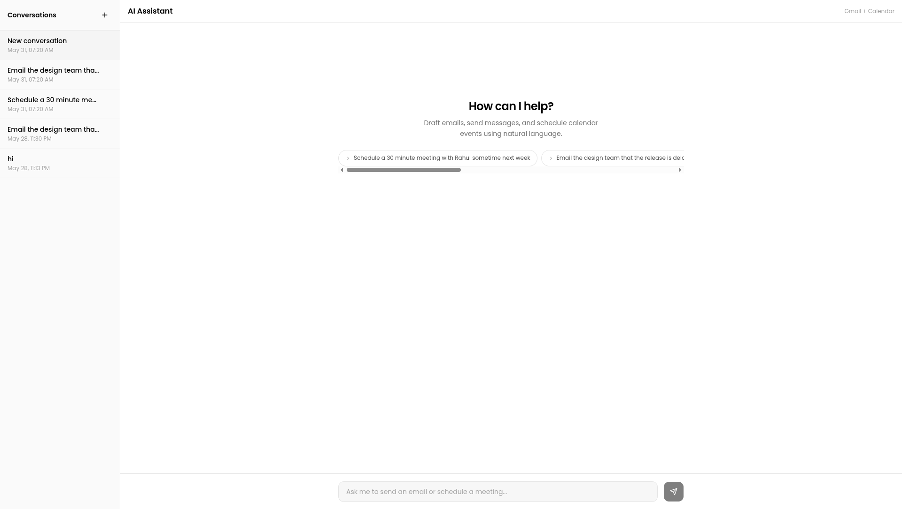
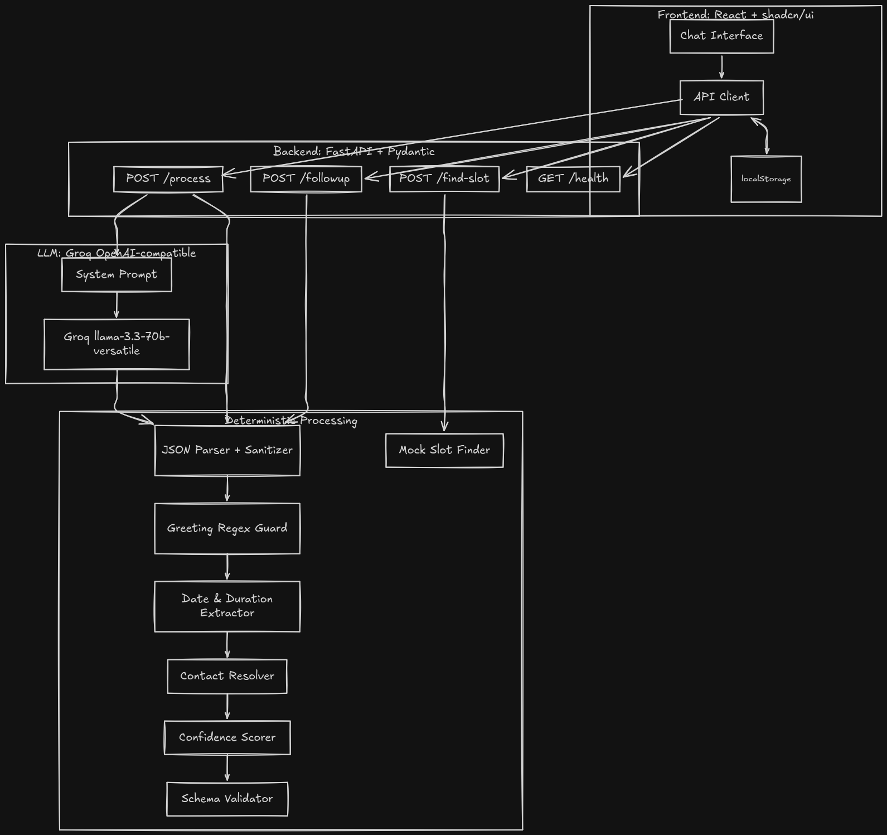

# Gmail + Calendar AI Assistant

A mini AI assistant that converts natural language requests into structured JSON actions for Gmail and Calendar

It uses FastAPI for the backend, React for the frontend shadcn for UI, and Groq (Llama 3) for the AI model

## Screenshots of frontend chat



## Architecture


## Features
- Understands intents: `send_email`, `draft_email`, `schedule_meeting`.
- Extracts entities (names, times, durations).
- Detects missing info and asks a follow-up question.
- Small web UI to chat and view the JSON output.

## Setup

### Backend

```bash
cd backend
python -m venv .venv
source .venv/bin/activate
pip install -r requirements.txt
cp .env.example .env
```

Add your Groq API key to `.env`:
```
GROQ_API_KEY=your_key_here
```

Run the server:
```bash
cd backend
uvicorn app.main:app --reload --port 8000
```

### Frontend

```bash
cd frontend
npm install
npm run dev
```
Then open http://localhost:5173

## Tests
```bash
cd backend
pytest -v
```

## System Prompt

```
You are an AI assistant that converts natural language requests into structured JSON actions for Gmail and Calendar operations.

Your job is to:
1. Identify the user intent: send_email, draft_email, or schedule_meeting
2. Extract all relevant parameters
3. Detect missing required information
4. Ask exactly one concise follow-up question if something is missing

Supported tools and their required fields:

send_email:
  Required: to (list of recipient names), body (email content)
  Optional: subject (string). If subject is not provided, generate a short, relevant subject line.

draft_email:
  Required: to (list of recipient names), body (email content)
  Optional: subject (string). If subject is not provided, generate a short, relevant subject line.

schedule_meeting:
  Required: participants (list of names), date (when the meeting should happen), duration_minutes (int)
  Optional: time_preference (morning, afternoon, evening), selected_slot (exact datetime string)

Available contacts: Rahul, Priya, John, Meera, Design Team, Engineering Managers.

Rules:
- Do NOT hallucinate values. If the user did not mention a field, leave it absent from args and add it to missing_fields.
- For emails, if body is missing, mark it missing. If subject is missing, you MAY infer a brief subject from context, but if unsure, mark it missing.
- For meetings, if duration is not mentioned, it is missing. If date/time is not mentioned, it is missing.
- Extract names exactly as they appear or map them to the closest available contact.
- confidence should be a float between 0.0 and 1.0. Higher when all required fields are explicitly provided. Lower when fields are missing or inferred.
- follow_up_question must be exactly one concise question. Use null if nothing is missing.
- missing_fields should list only the REQUIRED fields that are absent.
- If the user types a greeting, small talk, or something completely unrelated to email/calendar, default to "draft_email" with confidence 0.0, empty args, and a friendly follow_up_question like "Hi! I can help you send emails, draft messages, or schedule meetings. What would you like to do?"
- Return ONLY valid JSON. No markdown, no explanations.

Output schema:
{
  "tool": "send_email | draft_email | schedule_meeting",
  "confidence": 0.0,
  "args": {},
  "missing_fields": [],
  "follow_up_question": null
}
```

## Example Inputs and Outputs

### 1. Complete email request

Input: `Send an email to Rahul saying I will be late tomorrow`

Output:
```json
{
  "tool": "send_email",
  "confidence": 0.95,
  "args": {
    "to": [
      "Rahul"
    ],
    "body": "I will be late tomorrow"
  },
  "missing_fields": [],
  "follow_up_question": null
}
```

### 2. Draft email with topic

Input: `Draft an email to the design team about Friday's release`

Output:
```json
{
  "tool": "draft_email",
  "confidence": 0.95,
  "args": {
    "to": [
      "Design Team"
    ],
    "body": "about Friday's release"
  },
  "missing_fields": [],
  "follow_up_question": null
}
```

### 3. Complete meeting request

Input: `Schedule a 45 minute meeting with Rahul and Priya next Tuesday afternoon`

Output:
```json
{
  "tool": "schedule_meeting",
  "confidence": 0.95,
  "args": {
    "participants": [
      "Rahul",
      "Priya"
    ],
    "duration_minutes": 45,
    "time_preference": "afternoon",
    "date": "next Tuesday"
  },
  "missing_fields": [],
  "follow_up_question": null
}
```

### 4. Missing date and duration

Input: `Schedule a meeting with Rahul`

Output:
```json
{
  "tool": "schedule_meeting",
  "confidence": 0.58,
  "args": {
    "participants": [
      "Rahul"
    ]
  },
  "missing_fields": [
    "duration_minutes",
    "date"
  ],
  "follow_up_question": "How long should the meeting be (in minutes)?"
}
```

### 5. Missing email body

Input: `Send an email to Priya`

Output:
```json
{
  "tool": "send_email",
  "confidence": 0.68,
  "args": {
    "to": [
      "Priya"
    ]
  },
  "missing_fields": [
    "body"
  ],
  "follow_up_question": "What would you like the email to say?"
}
```

### 6. Send follow-up

Input: `Send a follow-up to John about the pending invoice`

Output:
```json
{
  "tool": "send_email",
  "confidence": 0.95,
  "args": {
    "to": [
      "John"
    ],
    "body": "about the pending invoice",
    "subject": "Follow-up on Pending Invoice"
  },
  "missing_fields": [],
  "follow_up_question": null
}
```

### 7. Calendar event with time

Input: `Create a calendar event with Priya and Meera tomorrow at 4 PM`

Output:
```json
{
  "tool": "schedule_meeting",
  "confidence": 0.77,
  "args": {
    "participants": [
      "Priya",
      "Meera"
    ],
    "date": "tomorrow",
    "time_preference": "afternoon",
    "selected_slot": "4 PM"
  },
  "missing_fields": [
    "duration_minutes"
  ],
  "follow_up_question": "How long should the meeting be (in minutes)?"
}
```

### 8. Group email

Input: `Draft an email to all engineering managers about the production issue`

Output:
```json
{
  "tool": "draft_email",
  "confidence": 0.68,
  "args": {
    "to": [
      "Engineering Managers"
    ],
    "subject": "Production Issue"
  },
  "missing_fields": [
    "body"
  ],
  "follow_up_question": "What would you like the email to say?"
}
```

### 9. Missing recipient and body

Input: `Send an email`

Output:
```json
{
  "tool": "draft_email",
  "confidence": 0.4,
  "args": {},
  "missing_fields": [
    "to",
    "body"
  ],
  "follow_up_question": "Who should I send this email to?"
}
```

### 10. Greeting

Input: `hi`

Output:
```json
{
  "tool": "draft_email",
  "confidence": 0,
  "args": {},
  "missing_fields": [
    "to",
    "body"
  ],
  "follow_up_question": "Hi! I can help you send emails, draft messages, or schedule meetings. What would you like to do?"
}
```

### 11. Optional slot finder

Input: `Find a 30 minute slot with Rahul and Priya tomorrow`

Output (via `POST /find-slot`):
```json
{
  "tool": "schedule_meeting",
  "confidence": 0.95,
  "args": {
    "participants": [
      "Rahul",
      "Priya"
    ],
    "duration_minutes": 30,
    "selected_slot": "2026-04-22 15:00",
    "date": "tomorrow"
  },
  "missing_fields": [],
  "follow_up_question": null
}
```

## Assumptions

- No real Gmail/Calendar APIs, everything is mocked with JSON since the assignment said that's fine
- Contacts and calendar slots are just hardcoded lists in `mock_data.py`
- If the LLM returns garbage or an unknown tool name, the parser falls back to `draft_email` instead of crashing
- I don't fill in default durations or dates on the first request, if the user didn't say it, we ask them
- Confidence is calculated on the backend based on how many required fields are present, instead of trusting whatever number the LLM gives back
- Vite proxies API calls to the backend so I didn't have to deal with CORS
- Chats are saved to localStorage so they don't disappear on refresh.
